# IoT-Protocol-Visual-System
Graduation design of HUST-CSE, about DICOM protocol and MQTT protocol visualzation.
## IoT protocol
### MQTT
https://docs.oasis-open.org/mqtt/mqtt/v5.0/mqtt-v5.0.html
### DICOM
https://dicom.nema.org/medical/dicom/current/output/pdf/part01.pdf
## Environment 
### change /etc/apt/source.list
Pay attention to the different sources from different Ubuntu Version  \
[Tsinghua-sources](https://mirrors.tuna.tsinghua.edu.cn/help/ubuntu/)
### Python venv create
```
 python version == 3.8.0
 sudo apt install python3-venv
 sudo python3 -m venv myvenv
 source ./myvenv/bin/activate
```
### Pip install 
```
pip install requirements.txt
```
## Back-end 
### authentication blueprint
- login
- register
### home blueprint
- protocol
    - add protocol name and port in L2-L7
- GeoIP
    - IP map database
- upload and decode
    - upload .pcap files 
    - decode using scapy from ether to tcp
- proto analyzer
    - statisticsis iot proto numbers from IP
    - statisticsis the most using proto
    - statisticsis the most number proto
- flow analyzer
    - time flow analyzer
    - in and out flow analyzer
    - packet and flow from IP analyzer
- iot analyzer
    - decode MQTT and DICOM message
    - segement merge
    - edit MQTT message
## Front-end
- refer [black-dashboard-flask](https://github.com/creativetimofficial/black-dashboard-flask)
- [echart.js](https://echarts.apache.org/en/index.html) and use [westeros.js](https://echarts.apache.org/en/theme-builder.html) theme

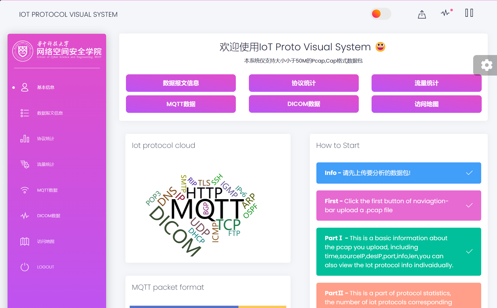
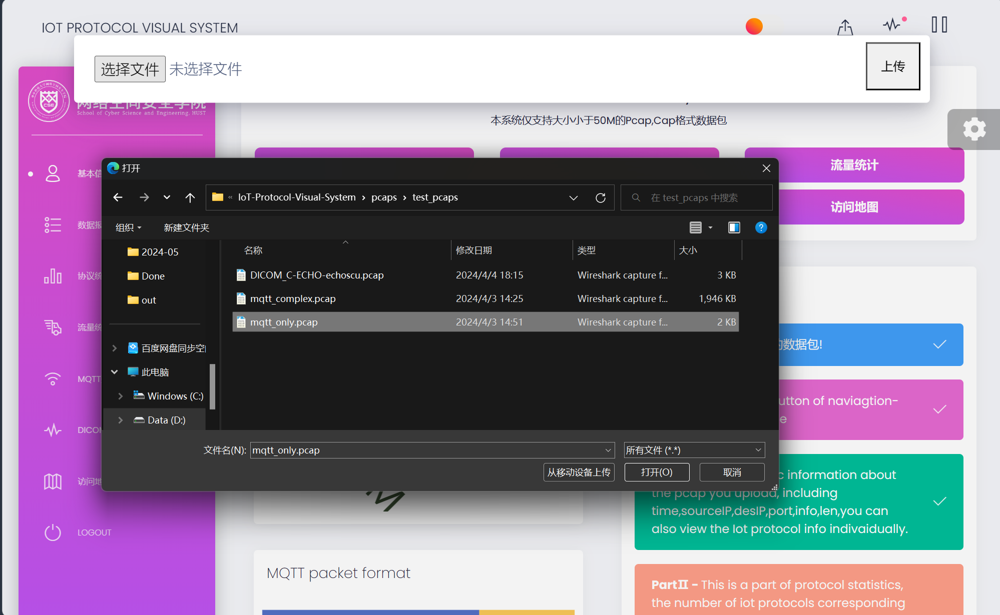
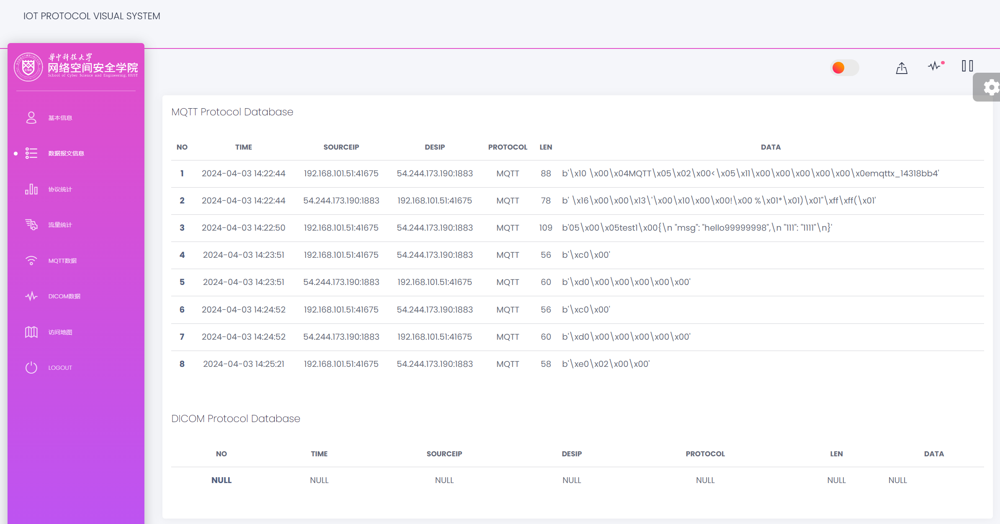
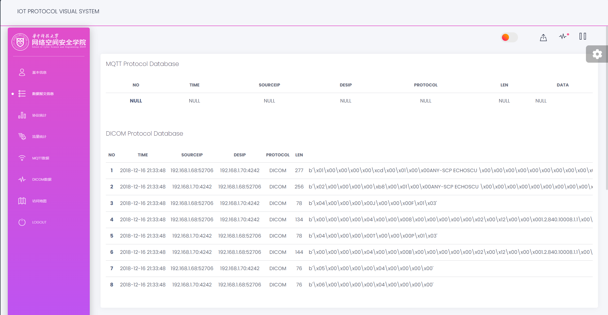
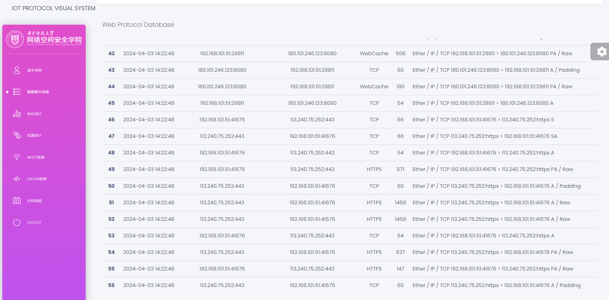
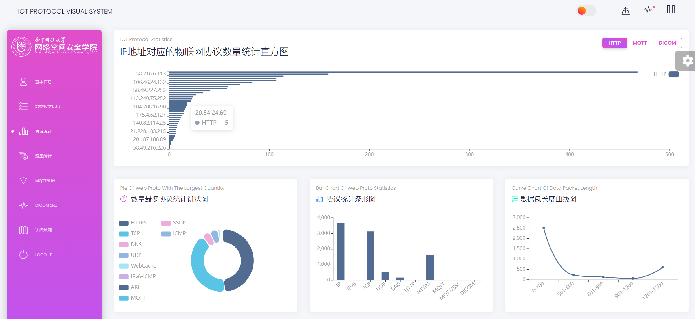
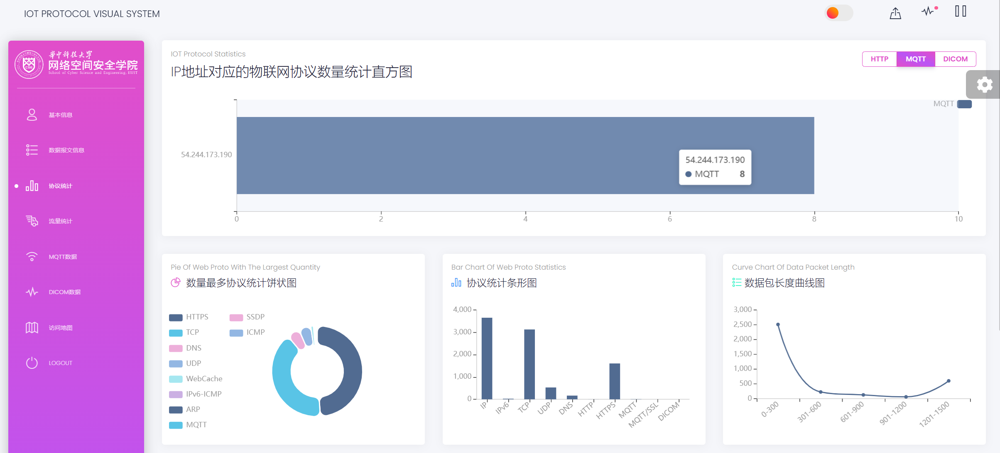
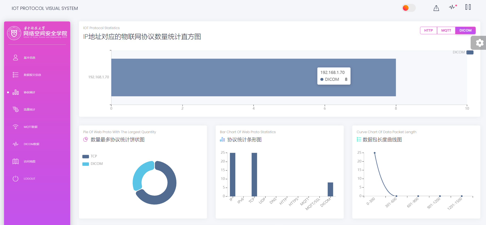
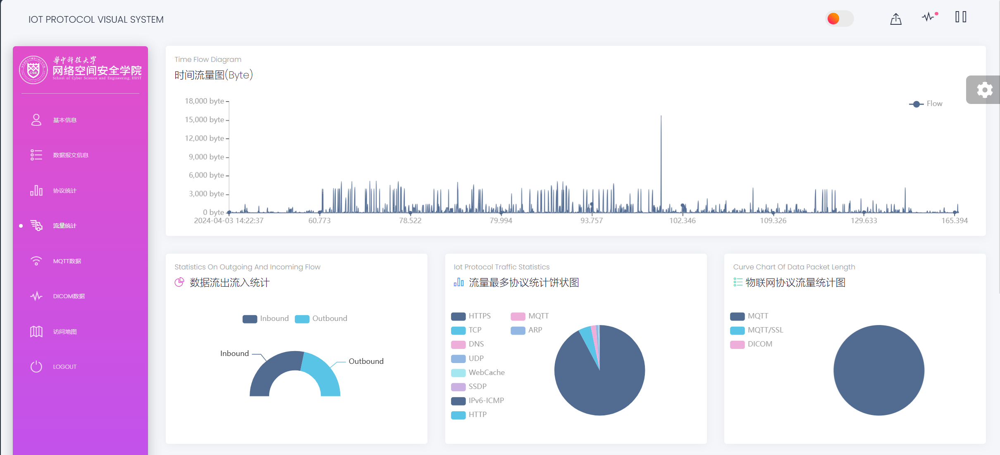
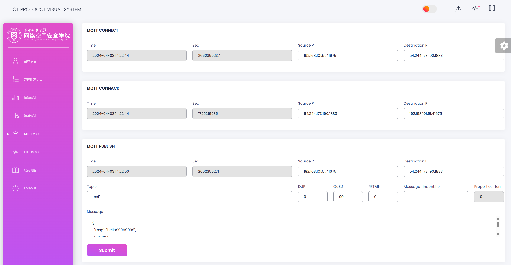
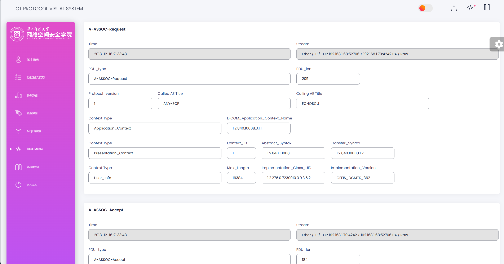
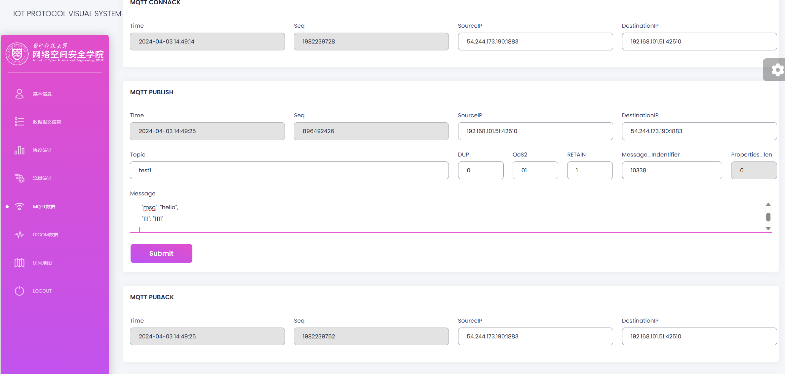
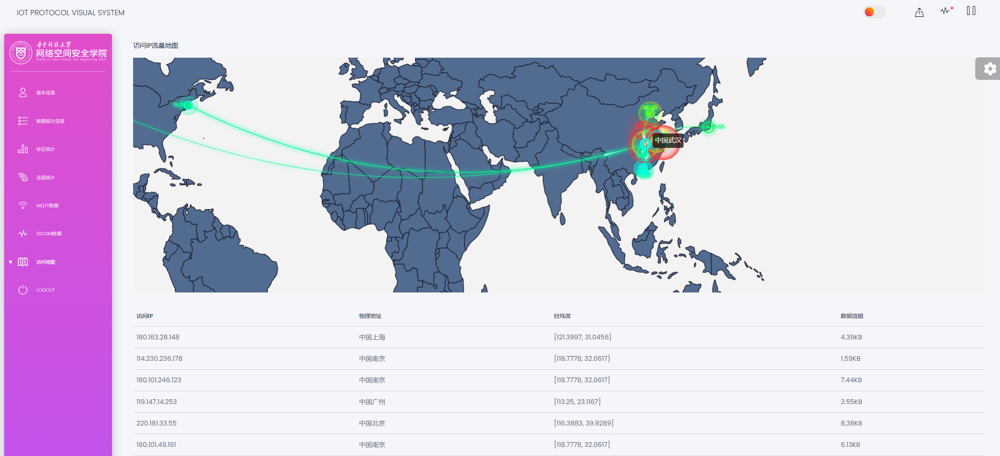